```mermaid
flowchart TD
    subgraph "Client Application"
        A["User types any command<br><i>e.g., &quot;show me what I have to do&quot;</i>"] --> B["Client sends text to the single endpoint"]
        B --> C["POST /chat"]
    end

    subgraph "MCP Server (With LangChain)"
        D["Endpoint: /chat"] --> E["<b>LangChain + LLM Router</b><br>Parses text into structured JSON"]
        E --> F["<i>e.g., &#123;action:'list'&#125;</i>"]
        F --> G{"Internal Routing<br>Based on JSON 'action'"}
        
        G -->|'add'| H["Private Logic: addTask"]
        G -->|'list'| I["Private Logic: listTasks"]
        G -->|'complete'| J["Private Logic: completeTask"]
        
        I --> K["Sends Task List to User"]
    end

    C --> D
    K --> A
```

# 🧠 AI To-Do Assistant (LangChain + Gemini + Cloudflare)

This is a simple AI-powered to-do assistant that runs on Cloudflare Workers. It uses **LangChain** and the **Google Gemini API** to understand natural language commands like:

- "Add 'buy milk' to my to-do list"
- "Mark task 1 as completed"
- "Show me what I have to do"
- "Delete the task about paying bills"

---

## 📦 Features

- Add, list, complete, and delete tasks using natural language.
- Deployed to a globally available Cloudflare Worker.
- Uses **LangChain** to structure prompts and manage the LLM interaction.
- Uses **Google Gemini** to parse natural language into structured JSON actions (`add` / `list` / `complete` / `delete`).
- Built with the lightweight Hono framework for routing.

---

## 🛠️ Project Setup

### 1. Requirements

- [Node.js](https://nodejs.org/en) (v18+ recommended)
- Cloudflare [Wrangler](https://developers.cloudflare.com/workers/wrangler/install-and-update/) CLI (`npm install -g wrangler`)
- A **Google Gemini API Key** (from [Google AI Studio](https://aistudio.google.com/app/apikey))

### 2. Install and Deploy

1.  **Clone the repository and install dependencies:**
    ```bash
    git clone <your-repo-url>
    cd <your-repo-folder>
    npm install
    ```

2.  **Set up your API Key for local development:**
    Create a file named `.dev.vars` in the project root and add your Gemini API key:
    ```
    GEMINI_API_KEY="AIzaSy...your...key...here"
    ```

3.  **Add your API Key to Cloudflare secrets for production:**
    This command securely stores your key for the deployed application.
    ```bash
    npx wrangler secret put GEMINI_API_KEY
    ```
    (Wrangler will then prompt you to paste your key.)

4.  **Deploy the worker:**
    ```bash
    npx wrangler deploy
    ```

---

## 🌐 API Usage

Send a **POST** request to the `/chat` endpoint of your deployed worker URL.

**Endpoint URL:** `https://your-worker-name.your-subdomain.workers.dev/chat`

### Request Body

The API accepts a single field: `message`.

```json
{
  "message": "Your natural language command for the to-do list."
}
```

### Inferred Actions

The Gemini model will interpret the `message` and the application will perform one of the following actions:

| Action | Inferred From | Description |
| :--- | :--- | :--- |
| `add` | "Add a new task..." | Adds a new task to the list. |
| `list` | "Show me my tasks" | Lists all current tasks. |
| `complete` | "Complete task 2" | Marks a task as completed using its ID. |
| `delete` | "Delete task 1" | Removes a task from the list using its ID. |

---

## 🔁 Example Prompt → Structured Output

The core of the application is turning a user's message into a structured JSON object that the code can understand.

**Input Prompt:**
> "Add 'Pay the electricity bill' to my to-do list"

**Gemini Model Output:**
```json
{
  "action": "add",
  "task": "Pay the electricity bill"
}
```

**Input Prompt:**
> "I finished task number 2"

**Gemini Model Output:**
```json
{
  "action": "complete",
  "id": 2
}
```

---
## Sample Test Cases
| Endpoint | Message |
|----------|---------|
| `/chat` (POST) | `"Add a task to call the bank"` |
| `/chat` (POST) | `"Show me all tasks"` |
| `/chat` (POST) | `"Mark task 1 as done"` |
| `/chat` (POST) | `"Remove task 1"` |
| `/chat` (POST) | `"Do something weird"` |
| `/chat` (POST) | `"Add something"` |
| `/chat` (POST) | `"Finish the task"` |
| `/chat` (POST) | `"Mark task 99 as done"` |
| `/chat` (POST) | `"Add a task"` *(Gemini returns invalid JSON)* |

---

## 📊 Flowchart


---

## 🔗 Live Endpoint

> [https://todo-mcp-langchain.hemanth-todo.workers.dev](https://todo-mcp-langchain.hemanth-todo.workers.dev)

---
